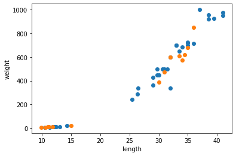
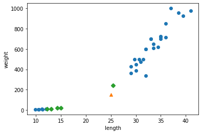
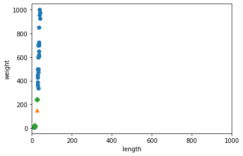
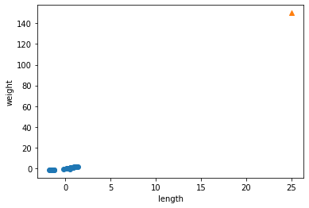
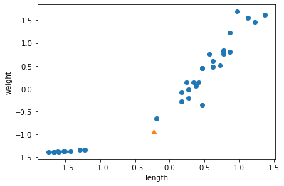

## 02-1훈련데이터의 일부를 테스트세트로 사용

데이터 출처 : https://bit.ly/bream_smelt

---
layout: single
title:  "CHAPTER 02"
categories: AI
---


```python
fish_length = [25.4, 26.3, 26.5, 29.0, 29.0, 29.7, 29.7, 30.0, 30.0, 30.7, 31.0, 31.0, 
                31.5, 32.0, 32.0, 32.0, 33.0, 33.0, 33.5, 33.5, 34.0, 34.0, 34.5, 35.0, 
                35.0, 35.0, 35.0, 36.0, 36.0, 37.0, 38.5, 38.5, 39.5, 41.0, 41.0, 9.8, 
                10.5, 10.6, 11.0, 11.2, 11.3, 11.8, 11.8, 12.0, 12.2, 12.4, 13.0, 14.3, 15.0]
fish_weight = [242.0, 290.0, 340.0, 363.0, 430.0, 450.0, 500.0, 390.0, 450.0, 500.0, 475.0, 500.0, 
                500.0, 340.0, 600.0, 600.0, 700.0, 700.0, 610.0, 650.0, 575.0, 685.0, 620.0, 680.0, 
                700.0, 725.0, 720.0, 714.0, 850.0, 1000.0, 920.0, 955.0, 925.0, 975.0, 950.0, 6.7, 
                7.5, 7.0, 9.7, 9.8, 8.7, 10.0, 9.9, 9.8, 12.2, 13.4, 12.2, 19.7, 19.9]
```


```python
# 각 생선의 길이와 무게를 하나의 리스트로 담기
fish_data = [[l,w] for l,w in zip(fish_length,fish_weight)]
fish_target = [1]*35 + [0]*14
```


```python
from sklearn.neighbors import KNeighborsClassifier
kn = KNeighborsClassifier()
print(fish_data)
```

    [[25.4, 242.0], [26.3, 290.0], [26.5, 340.0], [29.0, 363.0], [29.0, 430.0], [29.7, 450.0], [29.7, 500.0], [30.0, 390.0], [30.0, 450.0], [30.7, 500.0], [31.0, 475.0], [31.0, 500.0], [31.5, 500.0], [32.0, 340.0], [32.0, 600.0], [32.0, 600.0], [33.0, 700.0], [33.0, 700.0], [33.5, 610.0], [33.5, 650.0], [34.0, 575.0], [34.0, 685.0], [34.5, 620.0], [35.0, 680.0], [35.0, 700.0], [35.0, 725.0], [35.0, 720.0], [36.0, 714.0], [36.0, 850.0], [37.0, 1000.0], [38.5, 920.0], [38.5, 955.0], [39.5, 925.0], [41.0, 975.0], [41.0, 950.0], [9.8, 6.7], [10.5, 7.5], [10.6, 7.0], [11.0, 9.7], [11.2, 9.8], [11.3, 8.7], [11.8, 10.0], [11.8, 9.9], [12.0, 9.8], [12.2, 12.2], [12.4, 13.4], [13.0, 12.2], [14.3, 19.7], [15.0, 19.9]]
    


```python
# 배열의 요소를 선택할 때 : 인덱스를 지정
print(fish_data[4])
```

    [29.0, 430.0]
    


```python
# 배열의 요소 범위를 지정 : 슬라이싱
# 요소 첫 번째부터 다섯 번째까지 선택
print(fish_data[0:5])
print(fish_data[:5]) # 0 은 생략 가능
print(fish_data[44:]) # 마지막 원소까지 출력할 경우 마지막 원소는 생략
```

    [[25.4, 242.0], [26.3, 290.0], [26.5, 340.0], [29.0, 363.0], [29.0, 430.0]]
    [[25.4, 242.0], [26.3, 290.0], [26.5, 340.0], [29.0, 363.0], [29.0, 430.0]]
    [[12.2, 12.2], [12.4, 13.4], [13.0, 12.2], [14.3, 19.7], [15.0, 19.9]]
    

훈련데이터와 테스트데이터 나누기


```python
# 훈련 세트로 "입력값" 중 0~35까지
train_input = fish_data[:35]
# 훈련 세트로 "타겟값" 중 0~35까지
train_target = fish_target[:35]

# 테스트 세트로 "입력값" 중 0~35까지
test_input = fish_data[35:]
# 테스트 세트로 "타겟값" 중 0~35까지
test_target = fish_target[35:]
```

평가


```python
kn = kn.fit(train_input, train_target)
kn.score(test_input, test_target)
```


    0.0


## 정확도가 0.0이 나온 이유에 대하여 
훈련세트와 테스트세트를 구분하는 과정에서 샘플링의 편향으로 인해 제대로된 결과도출이 안됨

넘파이 사용하기


```python
import numpy as np
```


```python
input_arr = np.array(fish_data)
target_arr = np.array(fish_target)

print(input_arr)
print(target_arr)
```

    [[  25.4  242. ]
     [  26.3  290. ]
     [  26.5  340. ]
     [  29.   363. ]
     [  29.   430. ]
     [  29.7  450. ]
     [  29.7  500. ]
     [  30.   390. ]
     [  30.   450. ]
     [  30.7  500. ]
     [  31.   475. ]
     [  31.   500. ]
     [  31.5  500. ]
     [  32.   340. ]
     [  32.   600. ]
     [  32.   600. ]
     [  33.   700. ]
     [  33.   700. ]
     [  33.5  610. ]
     [  33.5  650. ]
     [  34.   575. ]
     [  34.   685. ]
     [  34.5  620. ]
     [  35.   680. ]
     [  35.   700. ]
     [  35.   725. ]
     [  35.   720. ]
     [  36.   714. ]
     [  36.   850. ]
     [  37.  1000. ]
     [  38.5  920. ]
     [  38.5  955. ]
     [  39.5  925. ]
     [  41.   975. ]
     [  41.   950. ]
     [   9.8    6.7]
     [  10.5    7.5]
     [  10.6    7. ]
     [  11.     9.7]
     [  11.2    9.8]
     [  11.3    8.7]
     [  11.8   10. ]
     [  11.8    9.9]
     [  12.     9.8]
     [  12.2   12.2]
     [  12.4   13.4]
     [  13.    12.2]
     [  14.3   19.7]
     [  15.    19.9]]
    [1 1 1 1 1 1 1 1 1 1 1 1 1 1 1 1 1 1 1 1 1 1 1 1 1 1 1 1 1 1 1 1 1 1 1 0 0
     0 0 0 0 0 0 0 0 0 0 0 0]
    


```python
#(샘플 수, 특성 수)
print(input_arr.shape)
```

    (49, 2)
    


```python
#0~48까지 인덱스를 생성하여 랜덤하게 섞기

np.random.seed(42) # 랜덤시드 지정 - 책과 동일한 랜덤생성을 위함
index = np.arange(49) # 0-48까지 1씩 증가하는 인덱스 생성
np.random.shuffle(index) # 섞기

print(index)
```

    [13 45 47 44 17 27 26 25 31 19 12  4 34  8  3  6 40 41 46 15  9 16 24 33
     30  0 43 32  5 29 11 36  1 21  2 37 35 23 39 10 22 18 48 20  7 42 14 28
     38]
    


```python
# 배열 슬라이싱 : 배열 요소를 선택
print(input_arr)
print(input_arr[[1,3]]) # input_arr[1] input_arr[3]
print(input_arr[1:3]) # input_arr[1]~input_arr[2]
```

    [[  25.4  242. ]
     [  26.3  290. ]
     [  26.5  340. ]
     [  29.   363. ]
     [  29.   430. ]
     [  29.7  450. ]
     [  29.7  500. ]
     [  30.   390. ]
     [  30.   450. ]
     [  30.7  500. ]
     [  31.   475. ]
     [  31.   500. ]
     [  31.5  500. ]
     [  32.   340. ]
     [  32.   600. ]
     [  32.   600. ]
     [  33.   700. ]
     [  33.   700. ]
     [  33.5  610. ]
     [  33.5  650. ]
     [  34.   575. ]
     [  34.   685. ]
     [  34.5  620. ]
     [  35.   680. ]
     [  35.   700. ]
     [  35.   725. ]
     [  35.   720. ]
     [  36.   714. ]
     [  36.   850. ]
     [  37.  1000. ]
     [  38.5  920. ]
     [  38.5  955. ]
     [  39.5  925. ]
     [  41.   975. ]
     [  41.   950. ]
     [   9.8    6.7]
     [  10.5    7.5]
     [  10.6    7. ]
     [  11.     9.7]
     [  11.2    9.8]
     [  11.3    8.7]
     [  11.8   10. ]
     [  11.8    9.9]
     [  12.     9.8]
     [  12.2   12.2]
     [  12.4   13.4]
     [  13.    12.2]
     [  14.3   19.7]
     [  15.    19.9]]
    [[ 26.3 290. ]
     [ 29.  363. ]]
    [[ 26.3 290. ]
     [ 26.5 340. ]]
    


```python
print(index[:35]) # index배열의 인덱스0~34 요소
print(index[35:]) # index배열의 인덱스35~끝 요소

train_input = input_arr[index[:35]]
train_target = target_arr[index[:35]]

test_input = input_arr[index[35:]]
test_target = target_arr[index[35:]]
```

    [13 45 47 44 17 27 26 25 31 19 12  4 34  8  3  6 40 41 46 15  9 16 24 33
     30  0 43 32  5 29 11 36  1 21  2]
    [37 35 23 39 10 22 18 48 20  7 42 14 28 38]
    


```python
# 섞기 전 배열의 13번 인덱스 요소가 섞인 후 train_input배열의 0번째 요소
print(input_arr[13], train_input[0])
```

    [ 32. 340.] [ 32. 340.]
    


```python
# 산점도 그리기
import matplotlib.pyplot as plt
print("train_input 배열의 [행전체,첫번째열] \n",train_input[:,0])
print("train_input 배열의 [행전체,두번째열] \n",train_input[:,1])
print("train_input \n",train_input)

plt.scatter(train_input[:,0], train_input[:,1])
plt.scatter(test_input[:,0], test_input[:,1])
plt.xlabel('length')
plt.ylabel('weight')
plt.show()
```

    train_input 배열의 [행전체,첫번째열] 
     [32.  12.4 14.3 12.2 33.  36.  35.  35.  38.5 33.5 31.5 29.  41.  30.
     29.  29.7 11.3 11.8 13.  32.  30.7 33.  35.  41.  38.5 25.4 12.  39.5
     29.7 37.  31.  10.5 26.3 34.  26.5]
    train_input 배열의 [행전체,두번째열] 
     [ 340.    13.4   19.7   12.2  700.   714.   720.   725.   955.   650.
      500.   430.   950.   450.   363.   500.     8.7   10.    12.2  600.
      500.   700.   700.   975.   920.   242.     9.8  925.   450.  1000.
      500.     7.5  290.   685.   340. ]
    train_input 
     [[  32.   340. ]
     [  12.4   13.4]
     [  14.3   19.7]
     [  12.2   12.2]
     [  33.   700. ]
     [  36.   714. ]
     [  35.   720. ]
     [  35.   725. ]
     [  38.5  955. ]
     [  33.5  650. ]
     [  31.5  500. ]
     [  29.   430. ]
     [  41.   950. ]
     [  30.   450. ]
     [  29.   363. ]
     [  29.7  500. ]
     [  11.3    8.7]
     [  11.8   10. ]
     [  13.    12.2]
     [  32.   600. ]
     [  30.7  500. ]
     [  33.   700. ]
     [  35.   700. ]
     [  41.   975. ]
     [  38.5  920. ]
     [  25.4  242. ]
     [  12.     9.8]
     [  39.5  925. ]
     [  29.7  450. ]
     [  37.  1000. ]
     [  31.   500. ]
     [  10.5    7.5]
     [  26.3  290. ]
     [  34.   685. ]
     [  26.5  340. ]]
    


    

    


두 번쨰 머신러닝 프로그램


```python
kn = kn.fit(train_input, train_target)
kn.score(test_input, test_target)
```


    1.0


## 02-2 데이터 전처리
 

넘파이로 데이터 쉽게 만들기


```python
# 행방향으로 데이터 넣기 : column_stack, 열방향 - row_stack
np.column_stack(([1,2,3],[4,5,6]))
print(np.column_stack(([1,2,3],[4,5,6])))

fish_data = np.column_stack((fish_length,fish_weight))
print(fish_data)
```

    [[1 4]
     [2 5]
     [3 6]]
    [[  25.4  242. ]
     [  26.3  290. ]
     [  26.5  340. ]
     [  29.   363. ]
     [  29.   430. ]
     [  29.7  450. ]
     [  29.7  500. ]
     [  30.   390. ]
     [  30.   450. ]
     [  30.7  500. ]
     [  31.   475. ]
     [  31.   500. ]
     [  31.5  500. ]
     [  32.   340. ]
     [  32.   600. ]
     [  32.   600. ]
     [  33.   700. ]
     [  33.   700. ]
     [  33.5  610. ]
     [  33.5  650. ]
     [  34.   575. ]
     [  34.   685. ]
     [  34.5  620. ]
     [  35.   680. ]
     [  35.   700. ]
     [  35.   725. ]
     [  35.   720. ]
     [  36.   714. ]
     [  36.   850. ]
     [  37.  1000. ]
     [  38.5  920. ]
     [  38.5  955. ]
     [  39.5  925. ]
     [  41.   975. ]
     [  41.   950. ]
     [   9.8    6.7]
     [  10.5    7.5]
     [  10.6    7. ]
     [  11.     9.7]
     [  11.2    9.8]
     [  11.3    8.7]
     [  11.8   10. ]
     [  11.8    9.9]
     [  12.     9.8]
     [  12.2   12.2]
     [  12.4   13.4]
     [  13.    12.2]
     [  14.3   19.7]
     [  15.    19.9]]
    


```python
# 넘파이로 0 과 1 체우기
print('np.ones(5) : ',np.ones(5))
print('np.zeros(5) : ',np.zeros(5))
# 배열 2개를 생성하고 연결하기
print('np.concatenate((np.ones(5),np.zeros(5))) : ',np.concatenate((np.ones(5),np.zeros(5))))

fish_target = np.concatenate((np.ones(35),np.zeros(14)))
print('fish_target : \n',fish_target)
```

    np.ones(5) :  [1. 1. 1. 1. 1.]
    np.zeros(5) :  [0. 0. 0. 0. 0.]
    np.concatenate((np.ones(5),np.zeros(5))) :  [1. 1. 1. 1. 1. 0. 0. 0. 0. 0.]
    fish_target : 
     [1. 1. 1. 1. 1. 1. 1. 1. 1. 1. 1. 1. 1. 1. 1. 1. 1. 1. 1. 1. 1. 1. 1. 1.
     1. 1. 1. 1. 1. 1. 1. 1. 1. 1. 1. 0. 0. 0. 0. 0. 0. 0. 0. 0. 0. 0. 0. 0.
     0.]
    

사이킷런으로 데이터 나누기


```python
from sklearn.model_selection import train_test_split
```


```python
train_input, test_input, train_target, test_target = train_test_split(fish_data, fish_target, stratify = fish_target, random_state = 42)

print(train_input.shape, test_input.shape)
print(train_target.shape, test_target.shape)
print(test_target)
```

    (36, 2) (13, 2)
    (36,) (13,)
    [0. 0. 1. 0. 1. 0. 1. 1. 1. 1. 1. 1. 1.]
    

k-최근접 이웃 훈련


```python
from sklearn.neighbors import KNeighborsClassifier

kn = KNeighborsClassifier()
kn.fit(train_input, train_target)
kn.score(test_input, test_target)
```


    1.0


```python
# 길이 25, 무게 150g 도미로 테스트 하기 : 1-도미, 0-빙어
print(kn.predict([[25,150]]))
```

    [0.]
    

산점도 그리기


```python
import matplotlib.pyplot as plt

plt.scatter(train_input[:,0],train_input[:,1])
plt.scatter(25,150, marker='^')
plt.xlabel('length')
plt.ylabel('weight')
plt.show()
```


    

    


길이 25, 무게 150g 도미가 빙어로 뜨는 이유에 대한 고찰


```python
distances, indexes = kn.kneighbors([[25,150]])
```


```python
plt.scatter(train_input[:,0],train_input[:,1])
plt.scatter(25,150, marker='^')
plt.scatter(train_input[indexes,0],train_input[indexes,1], marker='D')
plt.xlabel('length')
plt.ylabel('weight')
plt.show()
```


    

    


```python
print(train_input[indexes])
print(train_target[indexes])
print(distances)
```

    [[[ 25.4 242. ]
      [ 15.   19.9]
      [ 14.3  19.7]
      [ 13.   12.2]
      [ 12.2  12.2]]]
    [[1. 0. 0. 0. 0.]]
    [[ 92.00086956 130.48375378 130.73859415 138.32150953 138.39320793]]
    


```python
plt.scatter(train_input[:,0],train_input[:,1])
plt.scatter(25,150, marker='^')
plt.scatter(train_input[indexes,0],train_input[indexes,1], marker='D')
plt.xlim((0,1000))
plt.xlabel('length')
plt.ylabel('weight')
plt.show()
```


    

    


표준점수로 바꾸기


```python
mean = np.mean(train_input, axis = 0)
std = np.std(train_input, axis = 0)

print(mean, std)
train_scaled = (train_input - mean)/std
```

    [ 27.29722222 454.09722222] [  9.98244253 323.29893931]
    

전처리 데이터로 모델 훈련하기


```python
plt.scatter(train_scaled[:,0], train_scaled[:,1])
plt.scatter(25,150, marker='^')
plt.xlabel('length')
plt.ylabel('weight')
plt.show()
```


    

    


```python
new = ([25,150] - mean)/std
plt.scatter(train_scaled[:,0], train_scaled[:,1])
plt.scatter(new[0],new[1], marker='^')
plt.xlabel('length')
plt.ylabel('weight')
plt.show()
```


    

    


```python
kn.fit(train_scaled, train_target)

test_scaled = (test_input - mean)/std 
kn.score(test_scaled, test_target)
```


    1.0


```python
# 스케일링 이후 이상한 도미 데이터 예측하기
print(kn.predict([new]))
```

    [1.]
    

다시 산점도 그리기


```python
distances, indexes = kn.kneighbors([new])

plt.scatter(train_scaled[:,0], train_scaled[:,1])
plt.scatter(new[0],new[1], marker='^')
plt.scatter(train_scaled[indexes,0],train_scaled[indexes,1], marker='D')
plt.xlabel('length')
plt.ylabel('weight')
plt.show()
```


    

    

